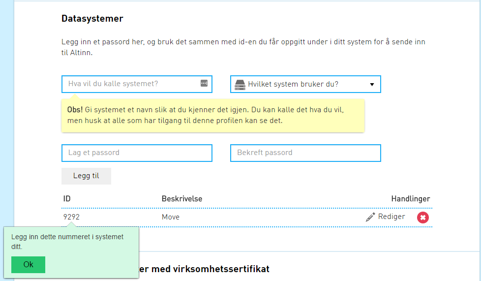

### Krav til kjøremiljø

+ Java 8 med JCE installert
+ 3x tilgjengelig minne i forhold til største meldinger ønsket sendt
+ Nødvendige brannmursåpninger
+ BestEdu ekspederingskanal skrudd på i sak-/arkivsystem


### Installere Java runtime environment (JRE)

Integrasjonspunktet og DeployManager er Java applikasjoner og krever derfor at man har Java kjøremiljø installert på maskinen dette skal kjøre.
For å verifisere om java er installert og hvilken versjon kan du i et kommandolinje vindu bruke kommandoen

```
java -version
```

Meldingsformidlingsapplikasjonen krever minimum versjon 1.8.0

Dersom Java ikke er installert eller versjonen er for gammel, kan ny versjon lastes ned [her](http://www.oracle.com/technetwork/java/javase/downloads/jdk8-downloads-2133151.html) og installeres.

### Installere Java Cryptography Extension (JCE)

Bruker du ny versjon av Java, må ny JCE installeres. Last ned JCE fra [Oracles sider](http://www.oracle.com/technetwork/java/javase/downloads/jce8-download-2133166.html).

Det er ikke noen enkel måte å sjekke om Java Cryptography Extension er installert. Ofte kan det enkleste være å bare laste ned og installere JCE, men om du ønsker å sjekke, kan du gå til mappen ```$JAVA_HOME/jre/lib/security``` og sjekke om filene ```US_export_policy.jar``` og ```local_policy.jar``` har nyere dato enn øvrige filer. Hvis datoen er lik, må du installere JCE.
Dersom JCE mangler vil integrasjonspunket stoppe under oppstart og skrive logmelding om manglende JCE.

### Virksomhetssertifikat

NB! Testmiljø krever testsertifikat. Produksjonsertifikat vil ikke virke i test


Integrasjonspunktet bruker virksomhetssertifikat til kryptering og signering av meldinger som går mellom integrasjonpunkter.
Virksomhetssertifikat som kan benyttes leveres av [Commfides](https://www.commfides.com/e-ID/Bestill-Commfides-Virksomhetssertifikat.html) og [Buypass](http://www.buypass.no/bedrift/produkter-og-tjenester/buypass-virksomhetssertifikat)

### Java Key Store (JKS)

Virksomhetssertifikatene må ligge i en Java key store.
Dersom du har p12 sertifikat kan dette konverteres til jks format slik:

```
keytool -importkeystore -srckeystore [MY_FILE.p12] -srcstoretype pkcs12
 -srcalias [ALIAS_SRC] -destkeystore [MY_KEYSTORE.jks]
 -deststoretype jks -deststorepass [PASSWORD_JKS] -destalias [ALIAS]
```

forklaring på bruk av kommandoen finnes [her](https://www.tbs-certificates.co.uk/FAQ/en/626.html)

Keytool finner du i

```
%JAVA_HOME%/bin
```

(f.eks C:\Program Files\Java\jre1.8.0_101\bin)

Når du har fått sertifikatet, må det legges inn på serveren du kjører integrasjonspunket. Noter deg lokasjonen for sertifikatet, samt brukernavn og passord.
Dette legges senere inn som propertiene, keystorelocation, privatekeypassword, privatekeyalias

### Laste opp public virksomhetssertifikat

Public key (.cer fil) kan sendes på e-post til [idporten@difi.no](mailto:idporten@difi.no). Dette er en midlertidig løsning og vil bli erstattet av en selvbehandlingstjeneste snart.

<!-- Public key (.cer fil) lastes opp til [virksomhetssertifikatserveren for test](https://beta-meldingsutveksling.difi.no/virksomhetssertifikat/) og [virksomhetssertifikatserveren for produksjon](https://meldingsutveksling.difi.no/virksomhetssertifikat/) -->

public key kan eksporteres fra keystore med kommandoen

```
keytool -export -keystore [MY_KEYSTORE.jks] -alias [ALIAS] -file [FILENAME.cer]
```

### Brannmursåpninger

Sentrale tjenester(Adresseoppslag, senteral konfigurasjon mm.)
+ 93.94.10.30:443
+ 93.94.10.45:443
+ 93.94.10.5:443

Logging
+ 93.94.10.18:8300


### Oppsett

Start med å opprette en mappe med navn integrasjonspunkt på c:\

Last deretter ned integrasjonspunktet fra artifactory (se link i top av dokument) og legg den i overnevnte mappe
Opprett filen integrasjonspunkt-local.properties på området

### integrasjonspunkt-local.properties

Følgende verdier settes i integrasjonspunkt-local.properties

NB: Benytt skråstrek (/) eller dobbel omvendt skråstrek (\\\\) som resursdeler når dere angir filbaner.

#### For alle installasjoner

**Propertie**                          |**Beskrivelse**                                                                                               |**Eksempel**
---------------------------------------|--------------------------------------------------------------------------------------------------------------|-----------------
server.port                            |Portnummer integrasjonspunktet skal kjøre på (default 9093)                                                   |9093
                                       |                                                                                                              |
difi.move.org.number                   |Organisasjonsnummer til din organisasjon (9 siffer)                                                           |123456789
difi.move.org.keystore.path            |Path til .jks fil                                                                                             |c:/integrajsonspunkt/keystore.jks
difi.move.org.keystore.password        |Passord til keystore                                                                                          |changeit
difi.move.org.keystore.alias           |Alias til virksomhetssertifikatet som brukes i integrasjonspunktet                                            |alias
difi.move.nextbest.serviceBus.enable   |Skru på bruk av eInnsynsmeldinger                                                                             |true
difi.move.nextbest.serviceBus.sasToken |Token som må brukes for tilang til meldingsformidler                                                          |*Se infobrev om einnsyn*


#### DPV spesifikke

**Propertie**                          |**Beskrivelse**                                                                                               |**Eksempel**
---------------------------------------|--------------------------------------------------------------------------------------------------------------|-----------------
difi.move.feature.enableDPV=true       |Skrur på muligheten til å sende meldinger til private virksomhter via AltInn                                  |true
difi.move.altinnPTV.username           |Brukernavn for AltInn tjenesteeier                                                                            |
difi.move.altinnPTV.password           |Passord for overnevnte bruker                                                                                 |


#### DPI spesifikke

**Propertie**                          |**Beskrivelse**                                                                                               |**Eksempel**
---------------------------------------|--------------------------------------------------------------------------------------------------------------|-----------------
difi.move.feature.enableDPI=true       |Skrur på muligheten til å sende meldinger til innbygger                                                       |true


#### DPO spesifikke

**Propertie**                          |**Beskrivelse**                                                                                               |**Eksempel**
---------------------------------------|--------------------------------------------------------------------------------------------------------------|-----------------
difi.move.feature.enableDPO=true       |Skrur på muligheten til å sende og motta DPO meldinger vi integrasjonspunktet                                 |true
difi.move.noarkSystem.endpointURL      |URL integrasjonspunktet finner sak-/arkivsystemets BestEdu tjenester                                          |Se eksempelfil for eksempel
difi.move.noarkSystem.type             |Sak/-arkivsystem type                                                                                         |ephorte/P360/WebSak/mail
difi.move.noarkSystem.username\*       |Brukernavn for autentisering mot sak-/arkivsystem                                                             |svc_sakark
difi.move.noarkSystem.password\*       |Passord for autentisering mot sak-/arkivsystem                                                                |changeit
difi.move.noarkSystem.domain\*         |Domene sakarkivsystemet kjører på                                                                             |
                                       |                                                                                                              |
difi.move.msh.endpointURL\*\*          |Path til MSH                                                                                                  |
                                       |                                                                                                              |
difi.move.altinn.username              |Brukernavnet du får ved [opprettelse av AltInn systembruker](#opprette-bruker-til-altinn-formidlingstjeneste) |123456
difi.move.altinn.password              |Passord du satte når du opprettet AltInn systembruker                                                         |changeit


\* Autentisering mot sakarkivsystem benyttes av P360

\*\* Denne brukes bare dersom du allerede har BestEdu og ønsker å sende filer via gammel MSH til deltakere som ikke er en del av piloten. Integrasjonspunktet vil da opptre som en proxy.

Last ned eksempel for [ephorte](../resources/integrasjonspunkt-local.properties_ephorte), [P360](../resources/integrasjonspunkt-local.properties_360), [WebSak](../resources/integrasjonspunkt-local.properties_websak)
Lagre filen på området c:\integrasjonspunkt og endre navnet til integrasjonspunkt-local.properties


Når du er ferdig skal strukturen på området se slik ut:

```
c:/
|-- integrasjonspunkt/
   |-- integrasjonspunkt-local.properties
```

### Opprette bruker til AltInn formidlingstjeneste

> Gjelder DPO (Digital post mellom offentlige virksomheter)

Integrasjonspunktet kjører som [datasystem](https://www.altinn.no/no/Portalhjelp/Datasystemer/) mot AltInn's meldingsformidler. Integrasjonspunktet må registeres som et datasystem AltInn's portal. Informasjon om hvordan dette gjøres finnes [her](https://www.altinn.no/no/Portalhjelp/Datasystemer/Registrere-datasystem/).

Når du oppretter datasystemet er det viktig at det gjøres av person som kan representere virksomheten. Hvordan man repreenterer virksomehen kan du lese [her](https://www.altinn.no/no/Portalhjelp/Hvordan-representere-andre/).

Under opprettelse av datasystem velger du passord og får tildelt brukerid (ID), disse skal senere brukes i properties filen som beskrives lenger nede.

Eksempel:

Registrere datasystem


Datasystem registrert



Informasjon om hvordan du logger på AltInn portal finner du [her](https://www.altinn.no/no/Portalhjelp/Innlogging/).


### Konfigurere sak-/arkivsystem til å bruke Integrasjonspunktet

> Gjelder DPO

Oppsett for ephorte, [P360](../resources/Oppsett360.docx), WebSak


### Start Integrasjonspunktet

Integrasjonspunktet startes fra kommandolinjen med kommandoen (Kjør som administrator)

```powershell
java -jar -Dspring.profiles.active=staging integrasjonspunkt-[versjon].jar --app.logger.enableSSL=false 
```


kommandoen

```
http://localhost:<port-til-integrasjonspunkt>/noarkExchange?wsdl
```

gir response i form av en wsdl når Integrasjonspunktet har startet.


Spørsmål rundt integrasjonspunktet installasjon eller forslag til forbedringer av installasjonsbeskrivelsen kan sendes til vår [supportmail](mailto:idporten@difi.no)


