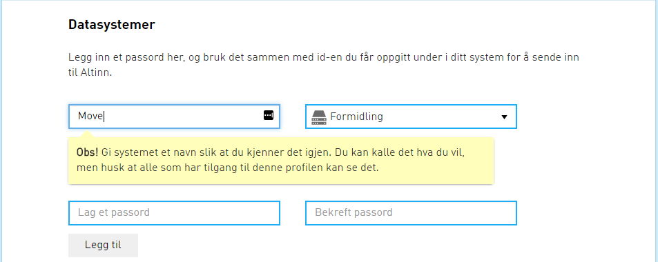
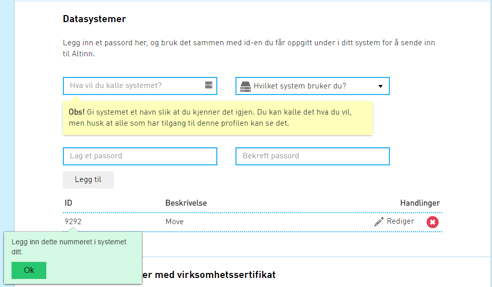

### Oppsett av DPI/DPO/DPV

### Brannmursåpninger
Tilleggsåpninger i brannmur er nødvendig for DPO, DPI og DPV.

Sentrale tjenester(Adresseoppslag, sentral konfigurasjon mm.)
+ beta-meldingsutveksling.difi.no -> 93.94.10.30:443, 93.94.10.45:443, 93.94.10.5:443

Id-portens autentiseringstjeneste
+ oidc-ver2.difi.no -> 146.192.252.152:443

Logging
+ 93.94.10.18:8300

Meldingsformidler DPO og DVP
+ www.altinn.no -> 79.171.86.33:443

Meldingsformidler DPI
+ qaoffentlig.meldingsformidler.digipost.no -> 146.192.168.18:443, 146.192.168.19:443

Meldingsformidler KS SvarUt/SvarInn
+ test.svarut.ks.no -> 193.161.160.165:443

### Integrasjonspunkt-local.properties filen

1. Start med å opprette en mappe med navn integrasjonspunkt på c:\
2. Last ned eksempel for [ephorte](../resources/integrasjonspunkt-local.properties_ephorte), [P360](../resources/integrasjonspunkt-local.properties_360), [WebSak](../resources/integrasjonspunkt-local.properties_websak)
Lagre filen på området c:\integrasjonspunkt og endre navnet til integrasjonspunkt-local.properties
3. Fyll inn verdier i integrasjonspunkt-local.properties

Når du er ferdig skal strukturen på området se slik ut:

```
c:/
|-- integrasjonspunkt/
   |-- integrasjonspunkt-local.properties
```


#### DPV spesifikke

**Propertie**                          |**Beskrivelse**                                                                                               |**Eksempel**
---------------------------------------|--------------------------------------------------------------------------------------------------------------|-----------------
difi.move.feature.enableDPV=true       |Skrur på muligheten til å sende meldinger til private virksomhter via AltInn                                  |true
difi.move.dpv.username           |Brukernavn for AltInn tjenesteeier                                                                            |
difi.move.dpv.password           |Passord for overnevnte bruker                                                                                 |


#### DPI spesifikke

**Propertie**                          |**Beskrivelse**                                                                                               |**Eksempel**
---------------------------------------|--------------------------------------------------------------------------------------------------------------|-----------------
difi.move.feature.enableDPI=true       |Skrur på muligheten til å sende meldinger til innbygger                                                       |true


#### DPO spesifikke

**Propertie**                          |**Beskrivelse**                                                                                               |**Eksempel**
---------------------------------------|--------------------------------------------------------------------------------------------------------------|-----------------
difi.move.feature.enableDPO=true       |Skrur på muligheten til å sende og motta DPO meldinger vi integrasjonspunktet                                 |true
difi.move.noarkSystem.endpointURL      |URL integrasjonspunktet finner sak-/arkivsystemets BestEdu tjenester                                          |Se eksempelfil for eksempel
difi.move.noarkSystem.type             |Sak/-arkivsystem type                                                                                         |ephorte/P360/WebSak/mail
difi.move.noarkSystem.username\*       |Brukernavn for autentisering mot sak-/arkivsystem                                                             |svc_sakark
difi.move.noarkSystem.password\*       |Passord for autentisering mot sak-/arkivsystem                                                                |changeit
difi.move.noarkSystem.domain\*         |Domene sakarkivsystemet kjører på                                                                             |
                                       |                                                                                                              |
difi.move.msh.endpointURL\*\*          |Path til MSH                                                                                                  |
                                       |                                                                                                              |
difi.move.dpo.username              |Brukernavnet du får ved [opprettelse av AltInn systembruker](#opprette-bruker-til-altinn-formidlingstjeneste) |123456
difi.move.dpo.password              |Passord du satte når du opprettet AltInn systembruker                                                         |changeit


\* Autentisering mot sakarkivsystem benyttes av P360

\*\* Denne brukes bare dersom du allerede har BestEdu og ønsker å sende filer via gammel MSH til deltakere som ikke er en del av piloten. Integrasjonspunktet vil da opptre som en proxy.


### Opprette bruker til AltInn formidlingstjeneste

> Gjelder DPO (Digital post mellom offentlige virksomheter)

Integrasjonspunktet kjører som [datasystem](https://www.altinn.no/no/Portalhjelp/Datasystemer/) mot AltInn's meldingsformidler. Integrasjonspunktet må registeres som et datasystem AltInn's portal. Informasjon om hvordan dette gjøres finnes [her](https://www.altinn.no/no/Portalhjelp/Datasystemer/Registrere-datasystem/).

Når du oppretter datasystemet er det viktig at det gjøres av person som kan representere virksomheten. Hvordan man repreenterer virksomehen kan du lese [her](https://www.altinn.no/no/Portalhjelp/Hvordan-representere-andre/).

Under opprettelse av datasystem velger du passord og får tildelt brukerid (ID), disse skal senere brukes i properties filen som beskrives lenger nede.

Eksempel:

Registrere datasystem



Datasystem registrert



Informasjon om hvordan du logger på AltInn portal finner du [her](https://www.altinn.no/no/Portalhjelp/Innlogging/).


### Konfigurere sak-/arkivsystem til å bruke Integrasjonspunktet

> Gjelder DPO

Oppsett for ephorte, [P360](../resources/Oppsett360.docx), WebSak

### Start Integrasjonspunktet

Integrasjonspunktet startes fra kommandolinjen med kommandoen (Kjør som administrator)

```powershell
java -jar -Dspring.profiles.active=staging integrasjonspunkt-[versjon].jar --app.logger.enableSSL=false 
```

Sjekk i nettleser når Integrasjonspunktet har startet, som gir response i form av en wsdl.

```
http://localhost:<port-til-integrasjonspunkt>/noarkExchange?wsdl
```

*** 

