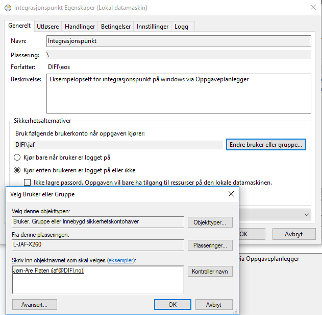
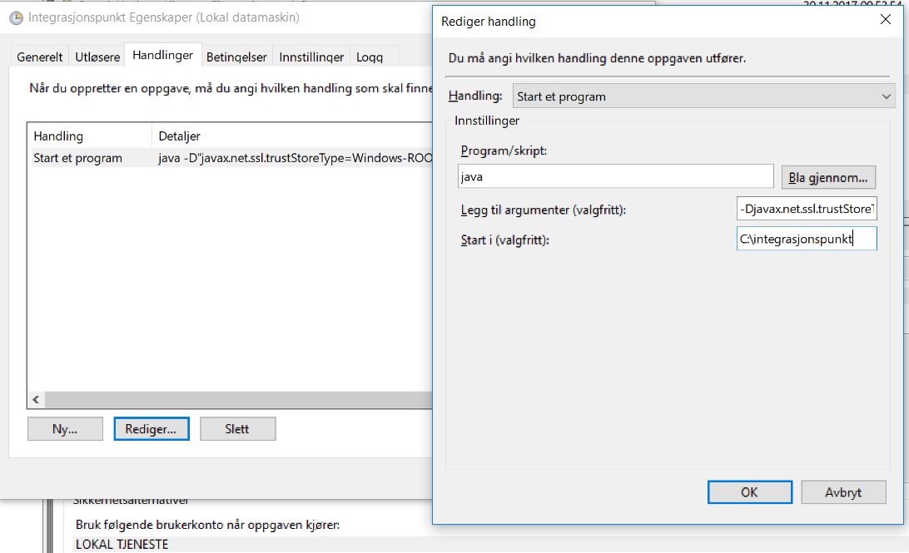

Når en skal starte integrasjonspunktet så kreves det visse rettigheter på denne brukeren for at programmet skal kunne fungere. 

**Opprette Lokal bruker type user:**

%servernavn%\integrasjonspunkt
 
**Sette rettar for brukar i local security policy (deaktivere påloggingsmulighet):**

- Deny log on locally
- Deny log on thru remote desktop service 
- Deny access to this computer from the network 
- Log on as a batch job (for å kunne kjøre taskscheduler)
 
**Bruker må ha tilgang på mappen der integrasjonspunktfilene ligger**

Egenskaper på mappen
  * Security:
    * Legg til integrasjonspunkBrukaren med modify rettigheter
  
## Kjøre kommandoen i "Task Scheduler"

**general:**

user: %servernavn%\integrasjonspunkt
- Run whether user is logged on or not
 
**Trigger:**
* At startup
   * Edit action
   * Program/script: JAVA
   * add argument (optional):
        * -jar integrasjonspunkt-%versjonsnr%.jar --app.logger.enableSSL=false
   * Start in (optional):
        * "disk:\mappenavn» til integrasjonspunktet"


***

## Alternativt: Installere integrasjonspunkt som en tjeneste

Integrasjonspunktet kan også installeres som en tjeneste på server. For å gjøre dette kan en laste ned en tredjepartsprogramvare og sette opp en egen liten config-fil.

Dokumentasjonen på programvaren du trenger ligger [på github](https://github.com/kohsuke/winsw). Du trenger to filer: .exe -filen fra dette programmet og en egen .xml-fil for å fortelle .exe -filen hvilke innstillinger som skal brukes. Dette er samme konseptet som [einnsyn-klient installasjonen er basert på](https://samarbeid.difi.no/einnsyn/utrulling/installsjonsrettleiing-klient). 

1. Last ned Winsw.exe [her](https://github.com/kohsuke/winsw/releases). Mer informasjon om hvilken versjon du skal velge står [her](https://github.com/kohsuke/winsw) og finn "supported .NET versions". Om du er usikker på hvilken .NET versjon du har, [les her](https://support.microsoft.com/nb-no/help/318785/how-to-determine-which-versions-and-service-pack-levels-of-the-microso)
2. last ned konfigurasjonsfila vår for [testmiljø](../resources/staging/integrasjonspunkt-service.xml) eller [produksjonsmiljø](../resources/integrasjonspunkt-service.xml)
3. Endre navn på .exe fila og xml-filene til de navnene du ønsker. For eksempel integrasjonspunkt-service.exe og integrasjonspunkt-service.xml
4. Legg begge disse filene i integrasjonspunktmappa di.
5. Endre versjonsnummeret på integrasjonspunkt-%versjonsnr%.jar til å være lik din versjon
* For å installere tjenesten gjør du følgende:
  - åpne kommandovindu som administrator og naviger til integrasjonspunktmappa. Kjør så følgende kommando
  - integrasjonspunkt-service.exe install
  - integrasjonspunkt-service.exe start

I denne config-fila er det lagt inn automatisk loggrotering ved 10MB størrelse og 8 filer vil bli beholdt. Dette kan endres til ønsket størrelse ved å endre ```<sizeThreshold>```variabelen.  Om du ikke ønsker loggrotering kan du fjerne hele ```<logmode>``` fra integrasjonspunkt-service.xml

Loggene for denne tjenesten vil i utgangspunktet bli skrevet til feks ```c:\integrasjonspunkt\integrasjonspunkt-logs``` og filen integrasjonspunkt-service.out. 

### Reinstallasjon av tjenesten

Om du gjør endringer i versjon / ip-service.xml fil så må du reinstallere tjenesten. Det gjør du ved å åpne kommandovindu som administrator og navigere til integrasjonspunktmappa. Kjør så følgende kommandoer.

```
- integrasjonspunkt-service.exe stop
- integrasjonspunkt-service.exe uninstall
- integrasjonspunkt-service.exe install
- integrasjonspunkt-service.exe start
```

Da er tjenesten reinstallert og restartet.

***

## Alternativt for bruk av proxy og Windows certificate store

Alternativt kan en legge inn virksomhetssertifikatet på lokal maskin i stedet for på bruker. Det krever noen justeringer for å få windows certificate store til å fungere på denne måten, en må også bruke task scheduler for dette. Her er det støtte for å bruke proxy ved å legge til litt ekstra i oppstartsargumentet. Det følgende eksempelet vil være for å bruke proxy, men en kan gjøre det samme ved å bytte ut oppstartsargumentet med tilsvarende som kan sees litt lenger opp på denne siden.

**general:**

1. Trykk på "endre bruker eller gruppe" / "change user or groups"
2. søk etter %servernamn%\integrasjonspunkt (eller anna ønska bruker) og trykk kontroller navn
3. trykk ok to ganger
4. Bekreft med passord for brukerkontoen



**Trigger:**
* At startup
   * Edit action
   * Program/script: JAVA
   * add argument (optional):
        * -Djavax.net.ssl.trustStoreType=Windows-ROOT -Dhttp.proxyHost=127.0.0.1 -Dhttp.proxyPort=8888 - Dhttps.proxyHost=127.0.0.1 -Dhttps.proxyPort=8888 -jar integrasjonspunkt%versjonsnr%.jar --app.logger.enableSSL=false
   * Start in (optional):
        * "disk:\mappenavn» til integrasjonspunktet"

I proxy kommandoen må en selvsagt bytte ut IP-adresser, porter og versjonsnummer fra dette eksempelet.




