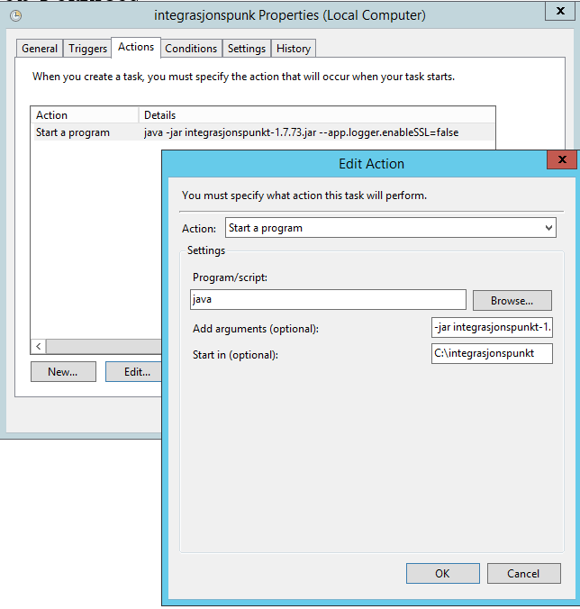

Når en skal starte integrasjonspunktet så kreves det visse rettigheter på denne brukeren for at programmet skal kunne fungere. 

**Opprette Lokal bruker type user:**

%servernavn%\integrasjonspunkt
 
**Sette rettar for brukar i local security policy (deaktivere påloggingsmulighet):**

- Deny log on locally
- Deny log on thru remote desktop service 
- Deny access to this computer from the network 
- Log on as a batch job (for å kunne kjøre taskscheduler)
 
Bruker må ha tilgang på mappen der integrasjonspunktfilene ligger 

**Egenskaper på mappen**
  Security:
    - Legg til integrasjonspunkBrukaren med modify rettigheter
  
## Kjøre kommandoen i "Task Scheduler"

**general:**

user: %servernavn%\integrasjonspunkt
- Run whether user is logged on or not
 
**Trigger:**
* At startup
- Edit action
- Program/script: JAVA


add argument (optional):
``` powershell
java -jar integrasjonspunkt-%versjonsnr%.jar --app.logger.enableSSL=false
```

Start in (optional):
``` powershell
  "disk:\mappenavn» til integrasjonspunktet"
```


