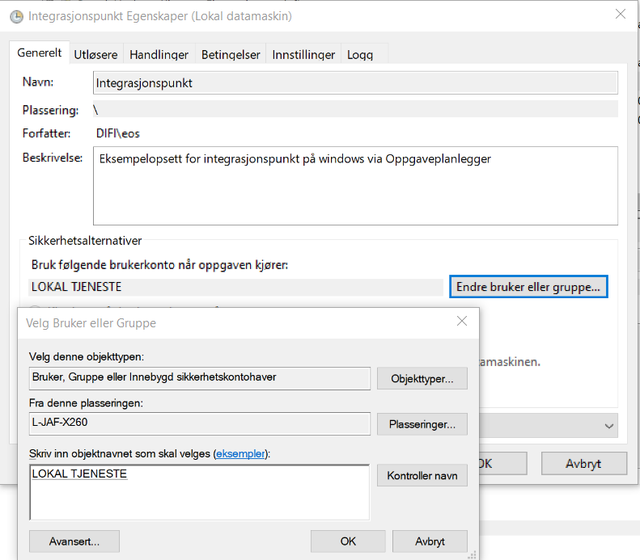

Når en skal starte integrasjonspunktet så kreves det visse rettigheter på denne brukeren for at programmet skal kunne fungere. 

**Opprette Lokal bruker type user:**

%servernavn%\integrasjonspunkt
 
**Sette rettar for brukar i local security policy (deaktivere påloggingsmulighet):**

- Deny log on locally
- Deny log on thru remote desktop service 
- Deny access to this computer from the network 
- Log on as a batch job (for å kunne kjøre taskscheduler)
 
**Bruker må ha tilgang på mappen der integrasjonspunktfilene ligger**

Egenskaper på mappen
  * Security:
    * Legg til integrasjonspunkBrukaren med modify rettigheter
  
## Kjøre kommandoen i "Task Scheduler"

**general:**

user: %servernavn%\integrasjonspunkt
- Run whether user is logged on or not
 
**Trigger:**
* At startup
   * Edit action
   * Program/script: JAVA
   * add argument (optional):
        * -jar integrasjonspunkt-%versjonsnr%.jar --app.logger.enableSSL=false
   * Start in (optional):
        * "disk:\mappenavn» til integrasjonspunktet"

## Alternativt for bruk av proxy og Windows certificate store

> **MERK** Dette er ikkje testa ut, endringer vil forekomme i denne delen av veiledninga. (29.11)

Alternativt kan en legge inn virksomhetssertifikatet på lokal maskin i stedet for bruker. Det krever noen endringer for å få windows certificate store til å fungere på denne måten, en må også bruke task scheduler for dette. Her er det støtte for å bruke proxy ved å legge til litt ekstra i oppstartsargumentet. 

**general:**

1. Trykk på "endre bruker eller gruppe" / "change user or groups"
2. søk etter LOKAL eller LOCAL (avhengig av språk på server)  og trykk "kontroller navn"
3. du vil då få treff på "LOKAL TJENESTE" eller "LOCAL SERVICE"
4. trykk ok

**Trigger:**
* At startup
   * Edit action
   * Program/script: JAVA
   * add argument (optional):
        * -Djavax.net.ssl.trustStoreType=Windows-ROOT -Dhttp.proxyHost=127.0.0.1 -Dhttp.proxyPort=8888 - Dhttps.proxyHost=127.0.0.1 -Dhttps.proxyPort=8888 -jar integrasjonspunkt%versjonsnr%.jar --app.logger.enableSSL=false
   * Start in (optional):
        * "disk:\mappenavn» til integrasjonspunktet"

I proxy kommandoen må en selvsagt bytte ut IP-adresser, porter og versjonsnummer fra dette eksempelet.

