Her vil det komme installasjonsveiledning for bruk av windows certificate store (30.11)

## Innstillinger i integrasjonspunktet-local.properties-fil

For å bruke Windows certificate store i stedet for Java keystore, så må en legge inn noen andre innstillinger i integrasjonspunkt-local.properties filen. [Last ned denne filen](../resources/integrasjonspunkt-local.properties) og kommenter bort eller slett "alternativ 1: java innstillinger". Kan gjerne rydde opp filen slik at du kun har de linjene du trenger. Se skjermbildet under.

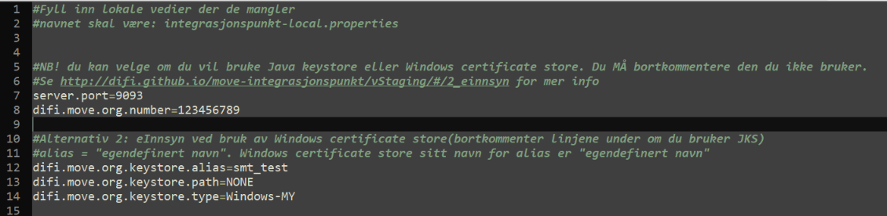

Alias tilsvarer egendefinert namn (friendly name) som kan ses på listen over brukersertifikater. Eller følg veiledning under for å navigere fram til det. Følg steg 1-5 så vil du få opp et bilde som ser ut som dette:

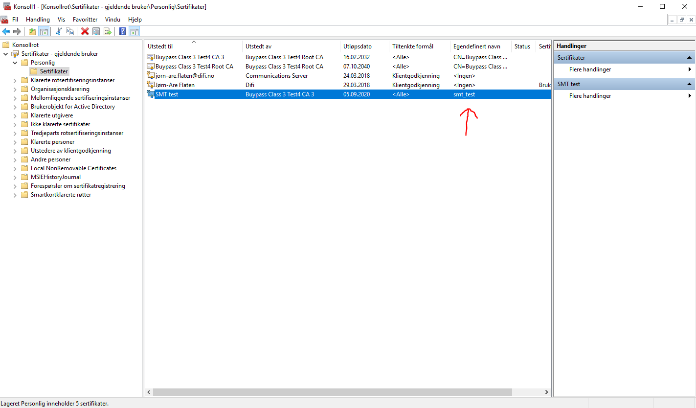

***

## Eksportere nøkkelparet frå .p12 keystore

Først må en eksportere nøkkelparet fra .p12 keystoren. Dette delen kan du skippe om du allerede har eksportert nøkkelparet (NB! Nøkkelpar != public nøkkel) 

1. åpne sertifikat p12.fil i keystore explorer
2. eksporter "key pair"
3. export
	- key pair
4. fyll inn passord på keystoren
5. fyll inn passord på privatnøkkelen (ofte samme passord om du bruker original p12-fil)
6. velg plassering for det nye sertifikatet og angi namn. Lagre det som .p12 fil. Trykk ok.
7. Nøkkelpar er nå eksportert.

**Skjermbilder følger:**

Steg 2 og 3: eksporter nøkkelpar
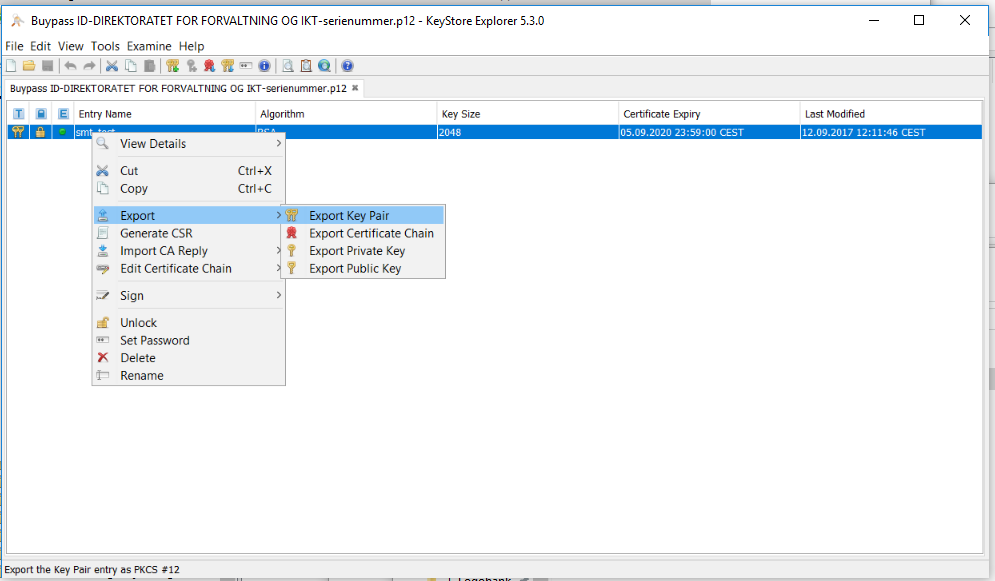

Steg 4: Keystore passord
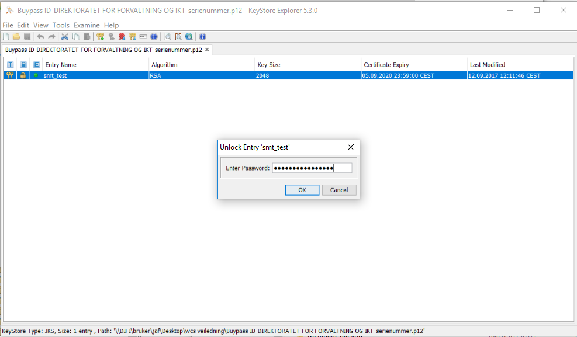

Steg 5 og 6: Privatnøkkel passord og velg filbane. 
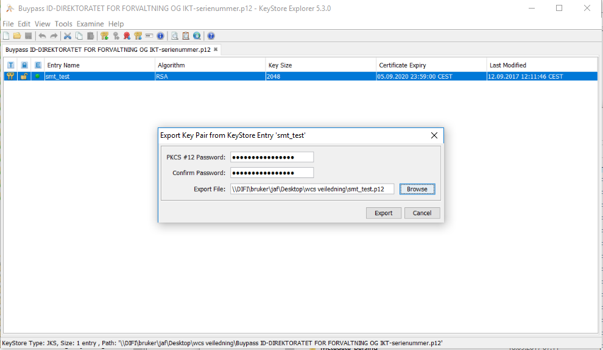

Steg 7: Nøkkelpar eksportert
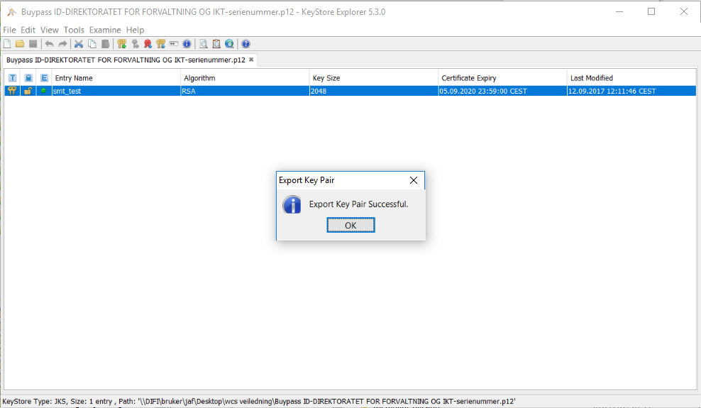

***

## Installere sertifikat i Windows Certificate Store

Det neste som må gjøres er å installere sertifikatet. Enten på "gjeldende bruker" eller "lokal maskin". Skjermbildene viser hvordan det gjøres for "gjeldende bruker / min brukerkonto". Prosessen er lik også for "lokal maskin". Da krysser du av for det i stedet.

1. Åpne opp mmc.exe
2. fil -> legg til/fjern snapin-modul
3. I venstre del av menyen (Tilgjengelige snapin-moduler) bla ned til "Sertifikater og trykk "legg til"
4. Her er det to valg. Enten å installere sertifikat på "min brukerkonto"(gjeldende bruker), eller å installere sertifikat på "lokal maskin". Om du skal bruke proxy må du velge "lokal maskin". 
	- velg "min brukerkonto" og trykk fullført. Trykk så ok.
	- velg "lokal maskin" og trykk fullført. Trykk så ok.
5. Naviger til ønsket mappe. For eksempel Personlig -> Sertifikater.
6. Høyreklikk på den hvite bakgrunnen og velg: "alle oppgaver" 
	- importer
7. Trykk neste -> bla igjennom kataloger og finner nøkkelparet du eksporterte tidlegare. (må gjerne filtrere på alle filer for å se filen). Velg nøkkelpar-filen og trykk neste.
8. Skriv inn passordet for privatnøkkelen. Trykk neste
9. Her kan du velge sertifikatlager, men vi ønsker å bruke default. Trykk neste
10. Import var vellykket. Trykk ok.
11. Nå vil du se det nye sertifikatet i listen over sertifikater du har importert.

**Skjermbilder følger:**

Steg 2: Legg til snapin-modul
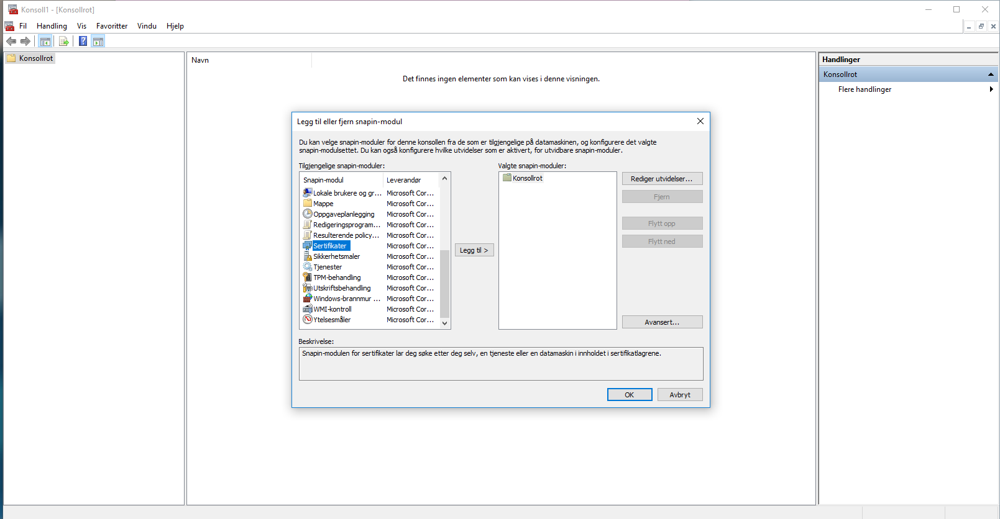

Steg 4: Velge hvilken snapin-modul som skal brukes
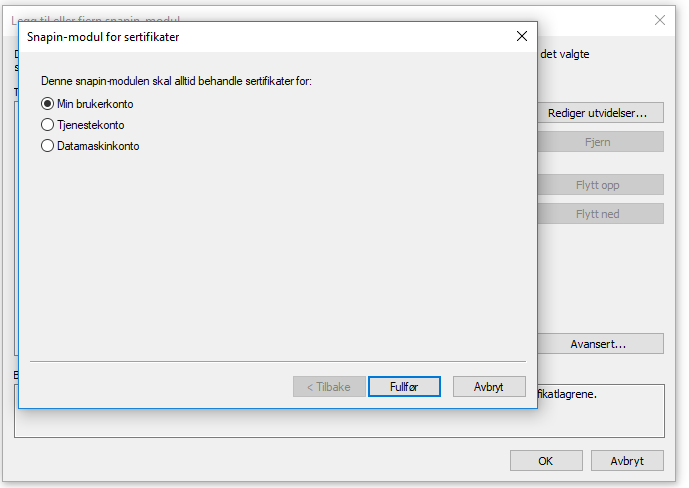

Steg 5: velge hvor sertifikatet skal installeres
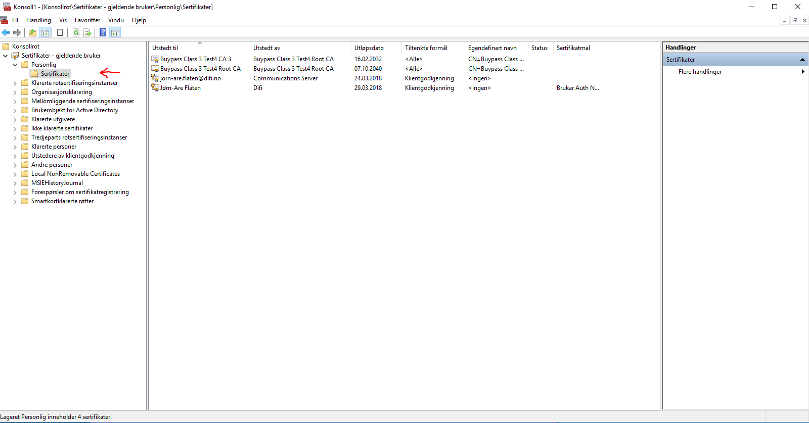

Steg 6: importer .p12-fil
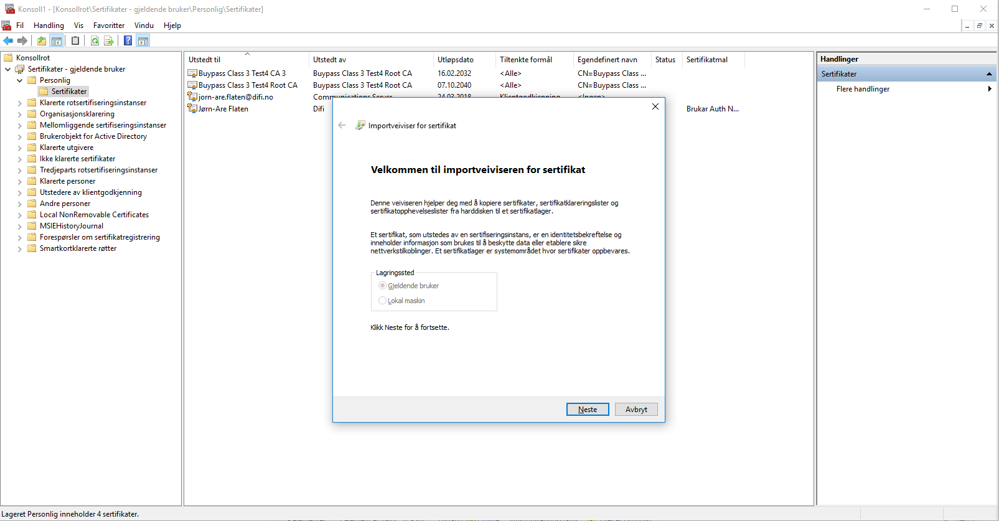

Steg 7: finn nøkkelpar-fila 
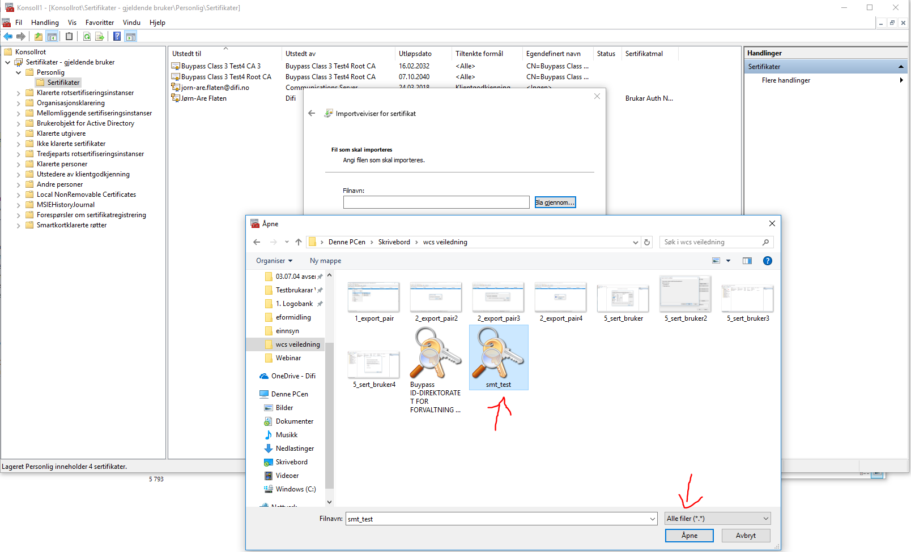

Steg 8: Passordet til privatnøkkelen
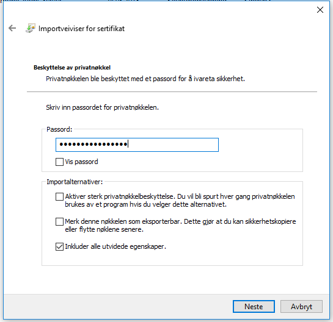

Steg 9: Velge sertifikatlager
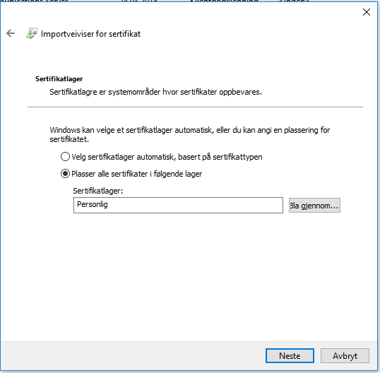

Steg 10: fullfør import
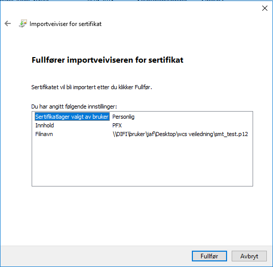

Steg 11: Sertifikatet er importert. 
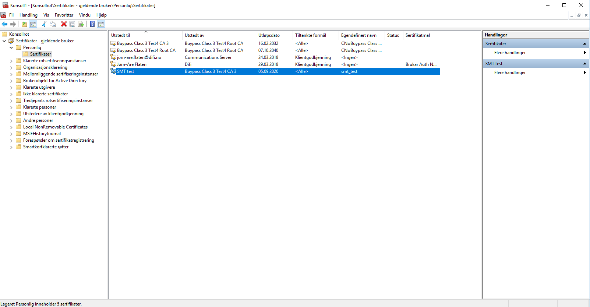

***
